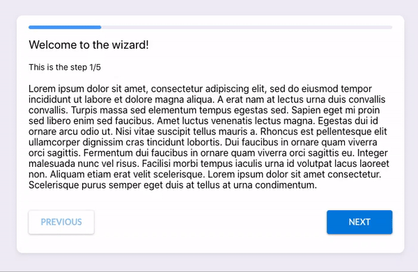

# react-wizard-builder

> A set of React components for building multi step wizards in a simple manner

[](https://www.npmjs.com/package/react-wizard) [](https://standardjs.com)




## Install 💻

npm:

```bash
npm install --save react-wizard-builder
```

yarn:

```bash
yarn add react-wizard-builder
```

## Usage ⚒️

```tsx
import Wizard from 'react-wizard-builder'

const App = () => (
  <Wizard
    renderHeader={(props) => <Header {...props} />}
    onNextStep={({ currentStep }) => console.log('On next step ' + currentStep)}
    onPreviousStep={({ currentStep }) => console.log('On previous step ' + currentStep)}
    onFinish={() => console.log('Wizard finished!')}
  >
    <Wizard.Step render={({ currentStep, next, previous, firstStep, lastStep }) => <div>Step 1</div>} />
    <Wizard.Step render={({ currentStep, next, previous, firstStep, lastStep }) => <div>Step 2</div>} />
    <Wizard.Step render={({ currentStep, next, previous, firstStep, lastStep }) => <div>Step 3</div>} />
  </Wizard>
)
```

## API 📚️

### `WizardFramework`

All render props receives the `WizardFramework` object as a parameter, wich has a set of utilities to handle the wizard:
| Prop | Type | Description
| ------------- |:-------------:| -----|
| currentStep | `Number`| The current step of the wizard.
| countSteps | `Number`| The amount of steps of the wizard.
| next | `Function`| Function to go to the next step.
| previous | `Function`| Function to go back to the previous step.
| goToStep | `Function`| Function to go to a specified step.
| lastStep | `Boolean`| Boolean which specifies if the current step is the last one.
| firstStep | `Boolean`| Boolean which specifies if the current step is the first one.

### `<Wizard>`

#### Props

| Prop                       |    Type    | Required | Description                                                                                                       |
| -------------------------- | :--------: | :------: | ----------------------------------------------------------------------------------------------------------------- |
| renderHeader               | `Function` |  `True`  | Function to render the header. Receives `WizardFramework` object as param and returns a React component.          |
| renderStatusBar            | `Function` |  `True`  | Function to render a custom status bar. Receives `WizardFramework` object as param and returns a React component. |
| hideStatusBar              | `Boolean`  | `False`  | Hides the status bar. Defaults to `False`.                                                                        |
| renderFooter               | `Function` | `False`  | Function to render a custom footer. Receives `WizardFramework` object as param and returns a React component.     |
| hideFooter                 | `Boolean`  |  `True`  | Hides the footer. Defaults to `False`.                                                                            |
| onNextStep                 | `Function` |  `True`  | Callback when the wizard will go to next step.                                                                    |
| onPreviousStep             | `Function` |  `True`  | Callback when the wizard will go to previous step.                                                                |
| onFinish                   | `Function` |  `True`  | Callback when the wizard will finish.                                                                             |
| initialStep                |  `Number`  | `False`  | Defaults to `0`.                                                                                                  |
| previousStepLabel          |  `String`  | `False`  | Label to show on previous step button. Defaults to 'Previous'.                                                    |
| nextStepLabel              |  `String`  | `False`  | Label to show on next step button. Defaults to 'Next'.                                                            |
| finishStepLabel            |  `String`  | `False`  | Label to show on finish wizard button. Defaults to 'Finish'.                                                      |
| className                  |  `String`  | `False`  | CSS class name to override default wizard styles.                                                                 |
| footerClassName            |  `String`  | `False`  | CSS class name to override default footer styles.                                                                 |
| statusBarClassName         |  `String`  | `False`  | CSS class name to override default status bar styles.                                                             |
| statusBarProgressClassName |  `String`  | `False`  | CSS class name to override default status bar progress styles.                                                    |

### `<Wizard.Step>`

#### Props

| Prop   |    Type    | Required | Description                                                                      |
| ------ | :--------: | :------: | -------------------------------------------------------------------------------- |
| render | `Function` |  `True`  | Function to render the step content. Receives `WizardFramework` object as param. |

## Examples 📘

Check sample code [here](https://github.com/nmartinezb3/react-wizard-builder/tree/master/example)

Live preview [here](https://nmartinezb3.github.io/react-wizard-builder/)

## Author ✍️
Nicolás Martínez - [nmartinezb3](https://github.com/nmartinezb3)

